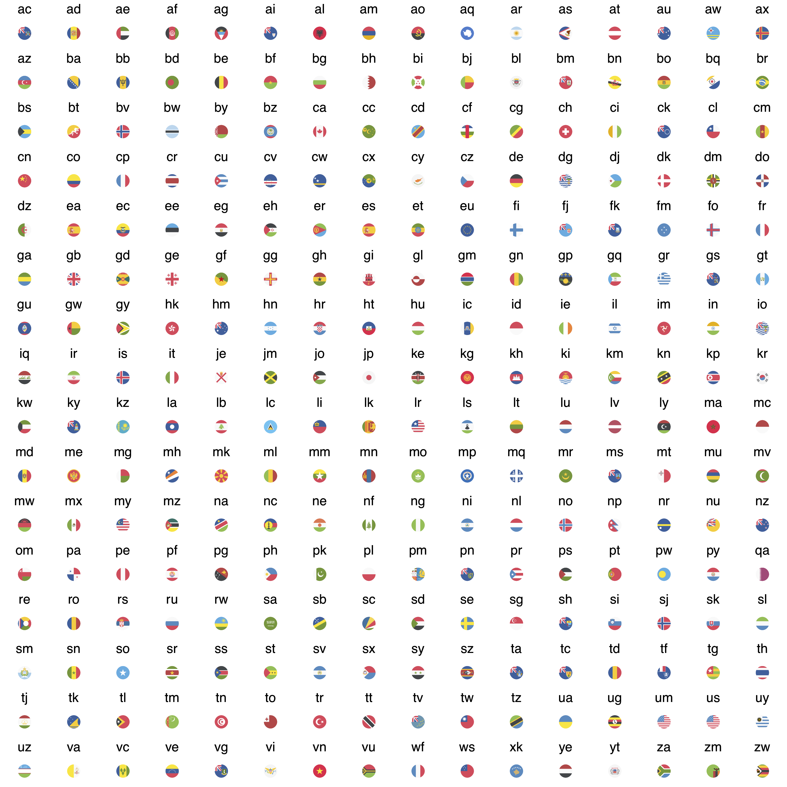

---
output:
  md_document:
    variant: markdown_github
---
## ggflags

A flag geom for ggplot2. This fork uses round flags from EmojiOne, which is nice for plotting as points!

```{r demo}
library(ggflags)

set.seed(1234)
d <- data.frame(x=rnorm(50), y=rnorm(50), 
                country=sample(c("ar","fr", "nz", "gb", "es", "ca"), 50, TRUE), 
                stringsAsFactors = FALSE)
ggplot(d, aes(x=x, y=y, country=country, size=x)) + 
  geom_flag() + 
  scale_country()
```

The flags in this fork of `ggflags`, from EmojiOne <https://github.com/eosrei/emojione-color-font>, are used under the [Creative Commons Attribution 4.0](https://github.com/eosrei/emojione-color-font/blob/master/LICENSE.md) licence.



(note: proof of principle only)

### To-do

[ ] Ditch PNGs and use smaller, rescalable SVGs (or another vector format)
